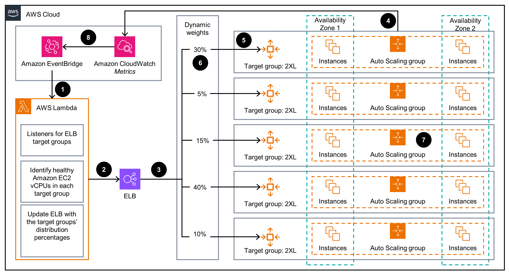

# Guidance for Optimizing Heterogeneous Auto Scaling Group Resource utilization on AWS

## Table of Contents 

1. [Overview](#overview-required)
    - [Cost](#cost)
2. [Prerequisites](#prerequisites-required)
    - [Operating System](#operating-system-required)
3. [Deployment Steps](#deployment-steps-required)
4. [Deployment Validation](#deployment-validation-required)
5. [Running the Guidance](#running-the-guidance-required)
6. [Next Steps](#next-steps-required)
7. [Cleanup](#cleanup-required)
8. [Conclusion](#conclusion)
9. [Authors](#authors-optional)

## Overview

For applications backed by heterogeneous instances in an Auto Scaling Group (ASG) that cannot effectively utilize all EC2 instances to their fullest capacity 
due to larger instances are effectively limited in their utilization because smaller instances reach their peak utilization sooner, when scale-out is based on target tracking by CPU utilization or other metric. 
This solution is also applicable for applications that cannot take advantage of the *Least Outstanding Request (LOR)* algorithm at the Target Group level, due to ultra-low latency request/response requirements, 
for example, AdTech bidding applications, high volume - low latency web applications, etc. 

With existing routing algorithms, AWS ELB cannot route or distribute requests proportionately to targets (EC2) with different weights or sizes to meet aforementioned workload requirements.
This problem particularly impacts the mixed instances policy in ASGs, which we recommend as a best practice for diversifying to as many different types and sizes of EC2 instances as best practice
for adopting EC2 Spot instances, that are priced up to 90% discount to on-demand instances.

 
Figure 1: Architecture Diagram showing the components deployed by the SAM template (At this moment it assumes that you already have created an ELB, Listeners, Target Groups(TGs), and Auto Scaling Groups in the environment you are testing this solution, and have access ELB Arn and Listener's Arn(s) to provide them in building/deploying SAM application)


### Cost

You are responsible for the cost of the AWS services used while running this Guidance. As of June 2024, the cost for running this Guidance with the default settings in the AWS Region US East (N. Virginia) is approximately $0.14 per month for processing 172,800 Lambda invocations to update dynamic weights to Target Groups of a Listener in an ELB.

We recommend creating a [Budget](https://docs.aws.amazon.com/cost-management/latest/userguide/budgets-managing-costs.html) through [AWS Cost Explorer](https://aws.amazon.com/aws-cost-management/aws-cost-explorer/) to help manage costs. Prices are subject to change. For full details, refer to the pricing webpage for each AWS service used in this Guidance.

### Sample Cost Table

The following table provides a sample cost breakdown for deploying this Guidance with the default parameters in the US East (N. Virginia) Region for one month.

| AWS service  | Dimensions | Cost [USD] |
| ----------- | ------------ | ------------ |
| AWS Lambda | 172,800 calls per month  | $0.14/month |


## Prerequisites

For this solution, you should have the following prerequisites: 
- An AWS account
- AWS CLI installed 
- SAM CLI installed 

To use the SAM CLI, you need the following tools.

* SAM CLI - [Install the SAM CLI](https://docs.aws.amazon.com/serverless-application-model/latest/developerguide/serverless-sam-cli-install.html)
* [Python 3 installed](https://www.python.org/downloads/)
* Docker - [Install Docker community edition](https://hub.docker.com/search/?type=edition&offering=community)

Following steps involved in the deployment of this solution which include preparing an 
* The solution assumes that multiple Auto Scaling Groups are defined with homogeneous set of instances (similar in t-shirt size, but can be from different families, generations, and availability zones)
Example: Similarly capable instances with different families C, M, R:- m5.2xlarge, c5.2xlarge, r5.2xlarge etc. in a single ASG, likewise, you may need to create another ASG with 4xlarge instances, etc. 
* Deploying the SAM template
* Test the solution to demonstrate how this solution forwards the Listener's traffic proportional to underlying Target Group's compute resources

### Operating System

- This solution can built/tested on any operating system. In Production, solution runs as serverless AWS Lambda fuction


### AWS account requirements (If applicable)

An AWS account with necessary permissions run Lambda function, configure Target Groups, crete/modify - Auto Scaling Groups, ELB (ALB), Listeners

## Deployment Steps

### Build and Deploy the SAM template

1. Clone the repo using command ```git clone https://github.com/aws-solutions-library-samples/guidance-for-optimizing-heterogeneous-auto-scaling-group-resource-utilization-on-aws.git```
2. cd to the repo folder ```cd guidance-for-optimizing-heterogeneous-auto-scaling-group-resource-utilization-on-aws```
3. Build the application
   - `sam build`
4. Deploy the SAM template using this command
   - `sam deploy --guided --capabilities CAPABILITY_NAMED_IAM`
5.	Provide values for the parameter prompts: 
   - Stack Name: Choose default or custom name
   - AWS Region: Choose same region where ELB, Listeners, Auto Scaling Groups are already available or can be created (SAM template support of creation of these artifacts not yet available).
   - ElbArn: Enter ELB ARN
   - ListOfListeners: List of comma separated Listener ARN(s), that are configured to forward requests to Target Groups based on weighted(%) distribution.
   - TargetGroupWeightUpdateFrequency: In Minutes. Frequency to update Target Group weights to dynamically change ELB traffic distribution, default is 15 minutes.
   - User: Type in your name (used for tagging resources)
6.	For the remaining prompts, use the default values. Note: for any following deployments, you can simply use “sam deploy” command as all your selected options have been saved to a configuration file. 
7.	Wait for the changeset to be created. You can track the stack progress on the CloudFormation console. 


## Deployment Validation
1. Open CloudFormation console and verify the status of the template with the name given above.
2. Check Lambda function starting with the name <stack name>-ElbAsgFunction
3. Check Configuration section of Lambda to verify the Role "CustomQueryEC2AsgUpdateElbRole" is associated to the Lambda function.

## Running the Guidance
Run stress test (on your application) to increase cpu load to scale out. Then observe after the periodic check, weights and traffic distribution percents are altered at ELB Listener's level.
1. Login into AWS Console
2. Navigate to EC2 and then, select Load Balancers, then select the ALB that you spplied in deployment step above
3. Select Listener that your application is listening on
4. Observe the % values for each Target Group under "Forward to target group" section
5. These % values are dynamically modified by this solution based on Auto Scalin Group's total compute capacity.

## Next Steps
You may modify of ELB Target Group's % weight update frequency to suit your environment
You may further customize the solution to suit your unique requirements. Intent of this solution is to provide the guidance of how to dynamically update forwarding weights at Target Groups on a Listener.

## Cleanup
To avoid incurring future charges, delete the resources deployed:
- Delete CloudFormation stack deployed by SAM, run following command and observe cloud formation stack and related components are deleted fully.
  - `sam delete`

## Conclusion
With this solution, you can achieve cost savings by increasing utilization of EC2 instances using homogeneous Auto Scaling Groups. 
You could also adopt various other sizes by defining multiple ASGs with similar sizes in each ASG.

## Authors
Author: Rajesh Kesaraju.
Rajesh Kesaraju is a Sr. Specialist Solution Aarchitect in EC2 Efficient Compute team, at Amazon AWS. He helps customers to cost optimize their workloads by utilizing EC2 Graviton Instances, Spot instances in various types of workloads such as containers, big data, HPC, CI/CD, stateless applications, etc.
